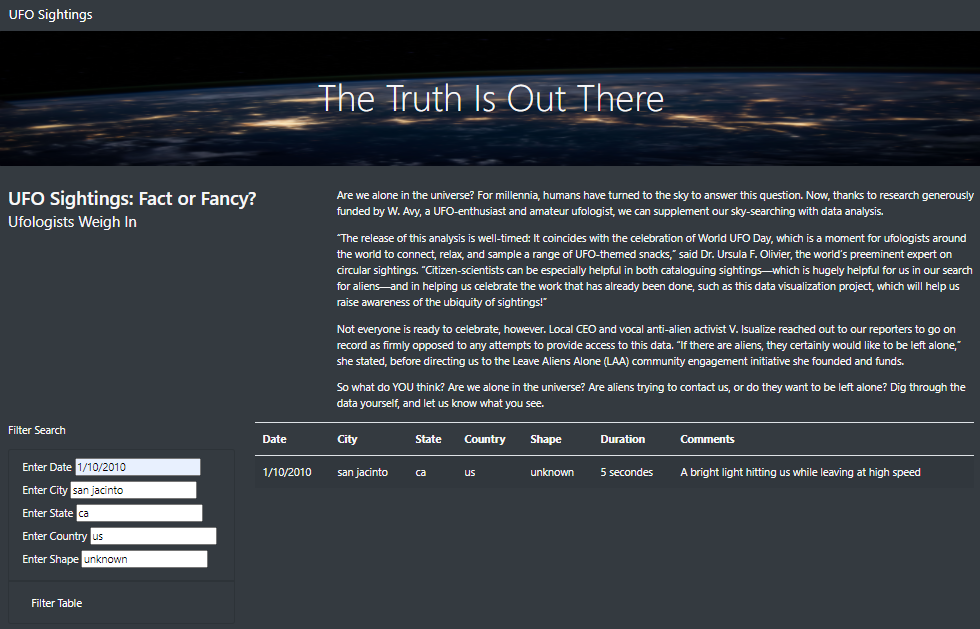

# UFOs

### "The Truth Is Out There"
Interested in learning more about UFO sightings? Come take a look at the index.html page, where you can read an article on UFOs and filter through sighting data. 

Using JavaScript, the data.js file filled with sighting information such as dates, cities, types of sightings, and more has been displayed as a table. Multiple filter options have also been added to the table for easier data manipulation. 

For additional visual appeal, a style.css file has been added as well as Bootstrap components to the index.html page. 

Preview the index.html page below:

